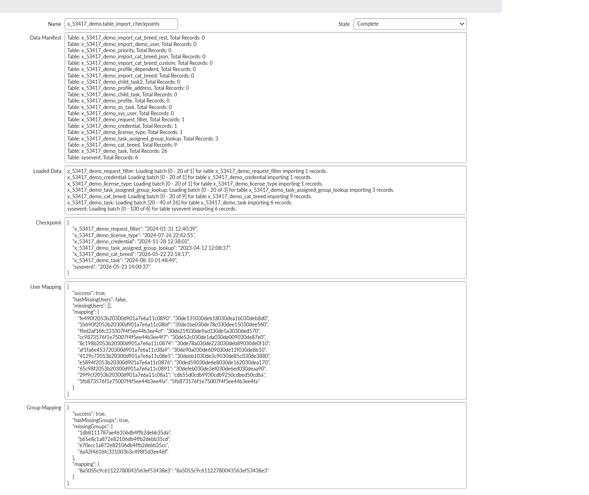

KLF_RecordImporter is a script that is for importing records from a source instance to a target instance. It is designed to be used with a data source to transfer data between instances. It uses a staging table to store the data before it is transformed and inserted into the target tables. The staging table is configured by the script with the necessary columns to store the data and the state of the import process.

There is an associated script that runs on the source instance that exposes a set of web services that the KLF_RecordImporter uses to retrieve the data. Communication between the source and target instances is initiated from the target instance by calling the appropriate functions on KLF_RecordImporter which then uses the KLF_RecordExporterService to call web services on the source instance to retrieve the data.

When constructing a KLF_RecordImporter, you need to provide the connection information for the source instance and a scope name to identify the import. KLF_RecordImporter will import data in batches. The batch size is configured when calling the importTableToStagingTable as well as the importScopedApplicationToStagingTable function.

Some data sets will be large. KLF_RecordImporter is designed to be resilient to failures and to be able to pick up where it left off. It does this by keeping track of the last imported record for each table in a checkpoint manifest. The checkpoint manifest is stored in the KLF_RecordImporter_State table and is updated after each batch is imported. If the import process fails, it can be restarted and it will only import new or updated records based on the checkpoint manifest.

Some records will require references to users and groups to be properly imported. This mapping is done on the source instance before sending the data to the target instance. The KLF_RecordImporter provides functions to initialize the user and group mappings. Again, the mapping itself is done on the source instance, but you can find the generated mapping on both the source and target instances. On the target system you can find the mapping in the KLF_RecordImporter_State table in the u_user_mapping and u_group_mapping columns.

There is a table called KLF_RecordImporter_State (u_klf_recordimporter_state) that stores the state of the import process. The import is unusual because it is importing data into multiple tables. This table allows tracking the progress of the import. You can see what tables are being imported and where in the process each table is. You can also see the mapping information used for the user and group table. This table has the following important columns:
| Column Name | Label | Description |
|---|---|---|
| `u_name` | Name | The name of the import. This is derived from the scope name given to the KLF_RecordImporter constructor. |
| `u_state` | State | The current state of the import process. Set to "loading" when in progress and "complete" when finished. |
| `u_data_manifest` | Data Manifest | A list of all tables included in the import and the number of records for each. Initialized at the start and not updated. |
| `u_loaded_data` | Loaded Data | A list of all records that have been imported. Updated in real-time during the import process. |
| `u_loaded_data_json` | Loaded Data JSON | A JSON version of the `u_loaded_data` column that is easier to query. |
| `u_checkpoint` | Checkpoint | A JSON object storing checkpoint information for each table. Used to track the last imported record and only import new or updated records in subsequent runs. |
| `u_scheduled_job_name` | Scheduled Import Name | The name of the Scheduled Import to manage from the checkpoint record. This must match the Scheduled Import record name. |
| `u_user_mapping` | User Mapping | A JSON object storing the mapping information for users from the source instance to the target instance. |
| `u_group_mapping` | Group Mapping | A JSON object storing the mapping information for groups from the source instance to the target instance. |
| `u_force_transform_all` | Force Transform All | A boolean flag indicating whether all records should be transformed regardless of whether they have been previously imported. When set to true, the import process will ignore existing records and force the transform to process all records. It is false by default |

Logging information can be found in the system logs. Logs generated by the KLF_RecordImporter will be under the source "KLF_RecordImporter". Logs generated by the KLF_RecordExporterService will be under the source "KLF_RecordExporterService". You can filter the logs by these sources to find the relevant logs for the import process.

# Managing Scheduled Imports from the Checkpoint Record
You can start the Scheduled Import from the Scheduled Import record directly, but you can also manage it from the checkpoint record in `u_klf_recordimporter_state`.

To manage from the checkpoint record, make sure these are set:
1. The checkpoint `Name` field (`u_name`) is set.
2. The `Scheduled Import Name` field (`u_scheduled_job_name`) is set to the exact Scheduled Import record name.

When those fields are set, you can manage the import from the checkpoint record:
1. Start Scheduled Import
2. Stop Data Load
3. Stop Transform

Action availability is state-based:
1. Start Scheduled Import is shown when the checkpoint is writable, `u_scheduled_job_name` is set, and the state is empty or `complete`.
2. Stop Data Load is shown when the checkpoint is writable, `u_scheduled_job_name` is set, and there is an active killable data load transaction for the scheduled job.
3. Stop Transform is shown when the checkpoint is writable, `u_scheduled_job_name` is set, the state is `transforming`, and there are active running transform runs.

If one of these actions is missing or has no effect, verify `u_name`, `u_scheduled_job_name`, and the current runtime state (active data load transaction or active transform run).

This is a breakdown of the steps to use KLF_RecordImporter:
1. Create a new Data Source record with the type "Custom (Load by Script)". The data source must be created in global scope.
2. Specify the script to run in the "Data Loaded" section of the data source. This script should construct a new KLF_RecordImporter and call the appropriate functions to import the data.
3. Create a new Transform Map with the target table set to "Global". This transform map will be used to transform the data from the staging table to the target tables. The transform map should have the appropriate scripts configured to call the KLF_RecordImporter functions to import the records.
4. Make sure you have installed the appropriate web services on the source instance. These web services are used by the KLF_RecordImporter to retrieve the data from the source instance.
5. You need to make sure that the user specified in the connection configuration has the appropriate permissions on the source instance to access the data being imported and to access the web services.

# Creating the Data Source
This is a high-level overview of what the code in the "Data Loaded" section of the data source should look like. The actual implementation will depend on the specific requirements of the import and the structure of the data being imported.

Start by ensuring that the staging table has the necessary columns to store the data and the state of the import process. The KLF_RecordImporter provides a function to build the staging table with the necessary columns. You can call this function in your script to ensure that the staging table is properly configured.

These are the important columns of the staging table:
| Column Name | Label | Description |
|---|---|---|
| `u_record_table_name` | record_table_name | The name of the table the record will be imported to |
| `u_record_sys_id` | record_sys_id | The sys_id of the record on the source instance. This is used for updates and to prevent duplicates. |
| `u_record_sys_updated_on` | record_sys_updated_on | The sys_updated_on value of the record on the source instance. This is used for updates. |
| `u_record_xml` | record_xml | The XML representation of the record. This is used to insert the data into the target table using global.GlideUpdateManager2 |
| `u_record_xml_attachment_sys_id` | record_xml_attachment_sys_id | The sys_id of the `sys_attachment` record storing the XML when the record is too large to store directly in `u_record_xml`. See the note on attachment size below. |
| `u_checkpoint_record` | checkpoint_record | The sys_id of the checkpoint record associated with this staging record. |

> **Note on large record XML:** If the XML for an imported record exceeds the `attachmentSizeThresholdMB` limit (default 10 MB), KLF_RecordImporter will store the XML as an attachment on the `sys_attachment` table instead of writing it to the `u_record_xml` column. The `u_record_xml_attachment_sys_id` column will contain the sys_id of the resulting `sys_attachment` record. This is necessary because ServiceNow stores string fields in MySQL `mediumtext` columns, which have a maximum size of 16 MB. The attachment is written with the file name format `<tableName>.<sysId>.record_xml` and content type `application/xml`. You can control the size threshold by passing the optional `attachmentSizeThresholdMB` argument to the KLF_RecordImporter constructor.

```javascript
// Add columns to import_set_table to store data
global.KLF_RecordImporter.buildImportSetTable(import_set_table);
```

Setup the connection configuration and construct a new KLF_RecordImporter instance. The connection configuration should include the instance URL, username, and password for the source instance. The scope name should be the same as the scope of the application you want to import, for example 'x_53417_demo'. The staging table name is the name of the import set table associated with the data source, which can be retrieved via `data_source.getValue('import_set_table_name')`.
```javascript
const connectionConfig = {
      instanceUrl: 'https://abspscpov2.service-now.com',
      username: 'admin',
      password: gs.getProperty('KLF_RecordSync.password')
  };

const scopeName = 'x_53417_demo';
const stagingTableName = data_source.getValue('import_set_table_name');
const importer = new global.KLF_RecordImporter(connectionConfig, scopeName, stagingTableName);	
```

After constructing the KLF_RecordImporter, you need to call the start function to initialize the import process. This will create a new record in the KLF_RecordImporter_State table to track the state of the import process.
```javascript
importer.start();
```

When transferring records that have references to users or groups, you need to initialize the user and group mappings. The KLF_RecordImporter provides functions to initialize the user and group mappings. You need to provide a function that retrieves the unique users and groups in the scope of the application being imported. This is necessary to ensure that the references to users and groups are properly mapped during the import process.

There are two places you can find the generated mappings. On the target system you can find the mapping in the KLF_RecordImporter_State table in the u_user_mapping and u_group_mapping columns. On the source system, the mapping is stored in a user preference with the key in the format of <scope_name>.mapping.user and <scope_name>.mapping.group. For example, if your scope name is x_53417_demo, the user mapping will be stored in a user preference with the key x_53417_demo.mapping.user and the group mapping will be stored in a user preference with the key x_53417_demo.mapping.group.
```javascript
// Make sure there are mappings set for User and Groups
function initMappings() {

  // Make sure you have a valid group mapping
  importer.initGroupMapping((exportService, scopeName) => {
    return exportService.getUniqueGroupsInScope(scopeName);
  });

  // Make sure you have a valid user mapping
  importer.initUserMapping((exportService, scopeName) => {
    return exportService.getUniqueUsersInScope(scopeName);
  });
}

initMappings();
```

If you are importing a scoped application, you can call the importScopedApplicationToStagingTable function to import all the tables in the scoped application. This function will find all the tables in the scoped application and import them to the staging table. It will order the import of the tables based on the number of records to be imported. 
```javascript
importer.importScopedApplicationToStagingTable({
  importSetTable: import_set_table, // This object is provided by the data source and is used to insert records into the staging table
  encodedQueryString: '', // You can specify an encoded query string to filter the records being imported. This is optional and can be left empty to import all records.
  excludedTables: [], // You can specify a list of tables to exclude from the import. This is optional and can be left empty to include all tables.
  batchSize: 20, // The number of records to import in each batch. This is optional and defaults to 20 if not specified.
  forceSync: false // If true, the import will ignore the checkpoint manifest and import all records. This is optional and defaults to false if not specified.
});
```

This function allows you to import a specific table to the staging table. You may need this if you want to import tables that are not part of the scoped application or if you want to import a specific table with a specific filter. The parameters are similar to the importScopedApplicationToStagingTable function with the addition of the tableName parameter to specify the name of the table to import and the skipMapping parameter to specify whether to skip the user and group mapping for this table. You may want to skip the mapping for certain tables that do not have references to users or groups.
```javascript
importer.importTableToStagingTable({
  tableName: 'sysevent',
  importSetTable: import_set_table,
  encodedQueryString: 'name=klf1',
  excludedTables: [],
  forceSync: false,
  batchSize: 100, // The number of records to import in each batch.
  skipMapping: true // If true, the import will skip the user and group mapping for this table. This is optional and defaults to false if not specified.
});
```

After you have called the import functions to import the data to the staging table, you need to call the complete function to mark the import process as complete. This will update the state of the import process in the KLF_RecordImporter_State table.
```javascript
importer.complete();
```

While the data is importing you can view the progress of the import in the KLF_RecordImporter_State table. You can find the record for your import by looking for the record with your scope name. Clicking on the record will show the details of the import. It will look something like below:



KLF_RecordImporter is intended to be used in "Custom (Load by Script)". This is the full example code that would be used in the "Data Loaded" script section of the data source:

```javascript
/**
 * @typedef {object} ImportSetTable
 * @property {(label: string, maxLength: number) => void} addColumn Adds a string-type column to the import set table.
 * @property {(label: string, maxLength: number) => void} addJSONColumn Adds a JSON-type column to the import set table.
 * @property {(label: string, maxLength: number) => void} addXMLColumn Adds an XML-type column to the import set table.
 * @property {(rowData: Record<string, unknown>) => void} insert Inserts one row (key = column name, value = column value).
 * @property {() => number} getMaximumRows Returns 20 for "Test load 20 records", otherwise -1.
 */

/**
 * @typedef {object} ImportLog
 * @property {(message: string) => void} info
 * @property {(message: string) => void} warn
 * @property {(message: string) => void} error
 */

/**
 * @param {ImportSetTable} import_set_table
 * @param {GlideRecord} data_source The data source referred to in the Data Source record.
 * @param {ImportLog} import_log The import activity log.
 * @param {GlideDateTime | string | null} last_success_import_time The last successful execution time for this data source.
 * @param {Record<string, unknown> | null} partition_info Partitioning info used for parallel loading.
 * @returns {void}
 */

// @ts-ignore
const importSetTable = /** @type {ImportSetTable} */ (import_set_table);
// @ts-ignore
const dataSource = /** @type {GlideRecord} */ (data_source);
// @ts-ignore
const importLog = /** @type {ImportLog} */ (import_log);
// @ts-ignore
const lastSuccessImportTime = /** @type {GlideDateTime | string | null} */ (last_success_import_time);
// @ts-ignore
const partitionInfo = /** @type {Record<string, unknown> | null} */ (partition_info);

(function loadData(import_set_table, data_source, import_log, last_success_import_time, partition_info) {
	// Add columns to import_set_table to store data
	global.KLF_RecordImporter.buildImportSetTable(import_set_table);

	const connectionConfig = {
        instanceUrl: 'https://abspscpov2.service-now.com',
        username: 'admin',
        password: gs.getProperty('KLF_RecordSync.password')
    };

	const scopeName = 'x_53417_demo';
	const stagingTableName = data_source.getValue('import_set_table_name');
	const importer = new global.KLF_RecordImporter(connectionConfig, scopeName, stagingTableName);	
	importer.start();

	// Make sure there are mappings set for User and Groups
	function initMappings() {

		// Make sure you have a valid group mapping
		importer.initGroupMapping((exportService, scopeName) => {
			return exportService.getUniqueGroupsInScope(scopeName);
		});

		// Make sure you have a valid user mapping
		importer.initUserMapping((exportService, scopeName) => {
			return exportService.getUniqueUsersInScope(scopeName);
		});
	}

	initMappings();

	importer.importScopedApplicationToStagingTable({
		importSetTable: import_set_table,
		encodedQueryString: '',
		excludedTables: [],
		batchSize: 20,
		forceSync: false
	});

	importer.importTableToStagingTable({
		tableName: 'sysevent',
		importSetTable: import_set_table,
		encodedQueryString: 'name=klf1',
		excludedTables: [],
		forceSync: false,
		batchSize: 100,
		skipMapping: true
	});

	importer.complete();

})(importSetTable, dataSource, importLog, lastSuccessImportTime, partitionInfo);
```

# Configuring the Transform Map
You also need a transform map. The transform map should be configured with the target table being Global (global). The global table is a special table that only has the core columns defined for all tables (sys_id, sys_updated_on, etc). This table should never be written to during the import process. This is just a placeholder. The transform map contains a onBefore script that is configured to "ignore" all inserts so nothing will be written to the target table. The XML in the staging table contains the real table name and data.

You must configure the following Transform Scripts for the transform map:

onStart:
```javascript
(function runTransformScript(source, map, log, target /*undefined onStart*/) {

	global.KLF_RecordImporter.onImportStart(import_set);

})(source, map, log, target);
```

onBefore:
```javascript
(function runTransformScript(source, map, log, target /*undefined onStart*/) {

	try {
		global.KLF_RecordImporter.importRecord(source);
	} catch(e) {
		gs.error(`Transform map ${map.getDisplayValue()} onBefore KLF_RecordImporter.importRecord threw error` + e);
	} finally {
		ignore = true;
	}

})(source, map, log, target);
```

onComplete:
```javascript
(function runTransformScript(source, map, log, target /*undefined onStart*/ ) {

	global.KLF_RecordImporter.onImportComplete(import_set);

})(source, map, log, target);
```
