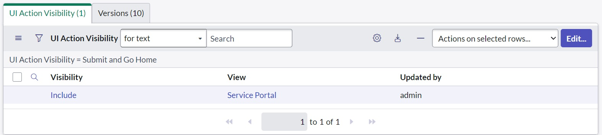

# Global KLF Utilities

These are script includes that execute in the `global` scope. They are used across applications. There is a brief description of each utility below. A more detailed description is included inside each script include.
- [KLF Form Widget](#KLF_Form)
- [KLF_AtfAddStepsHelper](#KLF_AtfAddStepsHelper)
- [KLF_CalendarCreator](#KLF_CalendarCreator)
- [KLF_CommandProbe](#KLF_CommandProbe)
- [KLF_GlideRecordUtils](#KLF_GlideRecordUtils)
- [KLF_GroupUtils](#KLF_GroupUtils)
- [KLF_LdapGroupService](#KLF_LdapGroupService)
- [KLF_MetricUtils](#KLF_MetricUtils)
- [KLF_RecordSync](#KLF_RecordSync)
- [KLF_ScoperUtils](#KLF_ScoperUtils)
- [KLF_SPUtils](#KLF_SPUtils)
- [KLF_TestUtils](#KLF_TestUtils)

## KLF Form Widget

This widget was cloned from the OOB Form widget

It has been modified to support the following:
- Support for client-side UI actions\
Example:
  ```javascript
  // This function is defined in the Script field of UI Action
  function submitServicePortal() {
  	// This is actually executing in the "KLF Form" widget scope
  	// This invokes the triggerAction function to submit the form
  	triggerAction();
  }
  
  if(typeof window == 'undefined') {
  	current.update();
  
  	// Hold reference to the current UI Action sys_id
  	var thisUIActionSysId = 'ad8de4c2473b461058ceeb02d16d4310';
  
  	// Function takes 2 parameters. First is the UI Action's sys_id
  	// Second is a function that returns the URL to redirect to after UI Action completes
  	new global.KLF_SPUtils().setRedirectURL(thisUIActionSysId, function() {
  		return '/sp';
  	});
  }
  ```
> NOTE: To make a client-side UI action visible to Service Portal you must add *Service Portal* to the
> *UI Action Visibility* related list of the UI action.
> 
- Support for applying templates (sys_template) to the form. The template name is passed as a URL parameter called 'template_name'
  Example: `https://example.service-now.com/sp?id=demo_form&table=my_task&sys_id=-1&template_name=demo_template`
- Support for redirecting to a URL after an action has been executed. Refer to `global.KLF_SPUtils.setRedirectURL` for more information
  Example:
  ```javascript
  // This function is defined in the Script field of UI Action
  // Execute your normal code in server side UI Action
  current.update();

  // This is the redirect code
  // Function takes 2 parameters. First is the UI Action's sys_id
  // Second is a function that returns the URL to redirect to after UI Action completes
  // In this scenario I am redirecting the user to create a new Incident after the form is saved
  new global.KLF_SPUtils().setRedirectURL(thisUIActionSysId, function() {
  	return '/sp?id=form&table=incident&sys_id=-1';
  });
  ```
- Support for showing all audit entries in the ticket conversation widget
  - TODO: Add screenshot showing more than STATUS audits being displayed

## KLF_AtfAddStepsHelper

Contains utility functions for dynamically creating ATF tests. The original use case for these utility methods was to
generate a baseline test template. Then using this script you could potentially generate copies of that template to
quickly create new tests.

## KLF_CalendarCreator

ServiceNow has a module called Business Calendar. Business Calendars are used to define time
periods that are significant to the business that differ from the standard calendar year.

Creating all the entries in a business calendar can be a tedious task. This script include
provides a way to create the entries for a fiscal quarter and fiscal year business calendar.
This script is specifically used to create the entries for the US Federal Government fiscal
year and quarters.

Example Usage:
```javascript
// This will generate Fiscal Year calendar for the years 1999 to 2040
// This must be run in global scope
// You will receive the error: "Could not find calendar using name: Fiscal Year"
// if you have not created a calendar with the name "Fiscal Year" in the system
// before calling this method
global.KLF_CalendarCreator.createFiscalYearNameEntries(1999, 2040);
global.KLF_CalendarCreator.createFiscalYearEntries(1999, 2040); 

// This will generate Fiscal Quarter calendar for the years 1999 to 2040
// This must be run in global scope
// You will receive the error: "Could not find calendar using name: Fiscal Year"
// if you have not created a calendar with the name "Fiscal Quarter" in the system
// before calling this method
global.KLF_CalendarCreator.createFiscalYearNameEntries(1999, 2040);
global.KLF_CalendarCreator.createFiscalYearEntries(1999, 2040);
```

## KLF_CommandProbe

This script is used to send commands to a mid server. It provides a mechanism to send the command to the midserver and
process the result of the command after the mid server executes the command

## KLF_GlideRecordUtils

This utility object provides a convenient way to execute GlideRecord operations from a scoped application
on globally scoped tables. This is useful when you need to perform operations on tables that are restricted
to global scope.

It also provides a function to transform a GlideRecord into a map. This is useful when you need to pass
GlideRecord data to a client script. The map can be easily converted to JSON and passed to the client spt.

## KLF_GroupUtils

This script contains general functions that help with group management in ServiceNow.
- getGroupByName: Retrieves the sys_user_group based on a group name or alias.
- getGroupFields: Finds all the fields that reference sys_user_group in a scoped app.
- changeGroupName: This looks for all references to group `oldName` in the system and replaces 
that group reference with the `newName` group. This is useful for when an application needs to update all the references of an old group
to a new group
- syncChildGroupMembers: This will make the membership of the parent group equal to the membership of its child groups. Basically, it copies the child group membership
into the parent group

## KLF_LdapGroupService

This script is used to ingest groups from LDAP into ServiceNow. Depending on the configuration
it can also properly ingest nested groups by recursively adding the members of nested groups
to the parent group.

It can ingest a single group or multiple groups. It can also refresh the membership of multiple
groups based on the group type names or sys_ids.

## KLF_MetricUtils

This script includes functions for working with metrics. Metrics are located in the Metrics module.
They are used to generated data associated with a record so that it can be used in reports.

Refer to the ServiceNow documentation for more information on metrics:
[Metrics](https://docs.servicenow.com/csh?topicname=c_MetricDefinitionSupport.html&version=latest)

Some of the functions in this script are:
- createMetricInstance: Creates a metric instance record for a given metric definition and record
- clearMetricsByRelatedRecord: Deletes all metric instances for a given record
- queueMetricUpdate: Used in a business rule to queue the metric.update event. This is used when creating metrics on a table that doesn't extend Task

## KLF_RecordSync

Object that provides methods to sync records between two ServiceNow instances

ServiceNow natively supports transferring application code between instances but does not expose an API to efficiently transfer data between instances.
This script include provides a way to transfer data between instances using the REST API. The basic idea is to script the data transfer in a way that
that is repeatable so the script can be written up front and then run whenever data needs to be transferred. This way the data transfer is automated
and there is no need to manually export and import data.

> NOTE: To use any of the sync methods you must install this application on the target
instance and the source instance. This scoped application contains the REST API that is used to import records into
the target instance. The open API spec for the REST API is located at 
[KLF Import XML Spec](klf_import_xml_openapi.yaml)

Example Usage:
```javascript
(function() {
    var scope = 'x_53417_demo';

    /**
     * When initializing the KLF_RecordSync object you must pass in a configuration object
     * that contains connection information to the target instance.
     */
    function getConnectionConfig() {
        var connectionConfig = {
            instanceUrl: 'https://dev229555.service-now.com/',
            username: 'admin',
            password: gs.getProperty('KLF_RecordSync.password'),
            chunkSize: 20
        };
        return connectionConfig;
    }

    /**
     * Creates a user mapping for the target instance
     * @returns {KLF_RecordSync_UserMapping}
     */
    function createUserMapping() {
        var connectionConfig = getConnectionConfig();
        var userUtils = new global.KLF_RecordSync_UserUtils(connectionConfig);
        var users = userUtils.getUniqueUsersInScope(scope);
        return userUtils.createUserMapping(users, scope);
    }

    /**
     * Creates a group mapping for the target instance
     * @returns {KLF_RecordSync_GroupMapping}
     */
    function createGroupMapping() {
        var connectionConfig = getConnectionConfig();
        var groupUtils = new global.KLF_RecordSync_GroupUtils(connectionConfig);
        var groups = groupUtils.getUniqueGroupsInScope(scope);
        return groupUtils.createGroupMapping(groups, scope);
    }

    /**
     * Checks the target instance for notifications that need to be updated
     */
    function checkNotifications() {
        var connectionConfig = getConnectionConfig();
        var groupUtils = new global.KLF_RecordSync_GroupUtils(connectionConfig);
        var notifications = groupUtils.getNotificationsUsingGroupsInScope(scope);
        if (notifications.length > 0) {
            gs.info('Check Notifications: ' + notifications.join('\n'));
        } else {
            gs.info('No notifications found');
        }
    }

    /**
     * Updates the notifications in the target instance
     */
    function updateNotifications() {
        var connectionConfig = getConnectionConfig();
        var groupUtils = new global.KLF_RecordSync_GroupUtils(connectionConfig);
        var notifications = groupUtils.getNotificationsUsingGroupsInScope(scope);
        groupUtils.updateRemoteNotifications(groupUtils.getGroupMapping(scope), notifications);
    }

    function transferData() {
        var connectionConfig = getConnectionConfig();
        var userMapping = new global.KLF_RecordSync_UserUtils(connectionConfig).getUserMapping(scope);
        var groupMapping = new global.KLF_RecordSync_GroupUtils(connectionConfig).getGroupMapping(scope);
        var recordSync = new global.KLF_RecordSync(connectionConfig, userMapping, groupMapping);

        // Example of syncing all the data in a scope
        // This will find all tables in the x_53417_demo scope and sync all the data in those tables
        recordSync.syncAllDataInScope('x_53417_demo');

        // Example of including approvals that are associated with the scope
        // This shows that you can also sync data that is outside of the scope as sysapproval_approver records
        // are in the global scope
        var demoApproval = new GlideRecord('sysapproval_approver');
        demoApproval.addQuery('source_table', 'STARTSWITH', 'x_53417_demo');
        recordSync.syncTable('sysapproval_approver', demoApproval.getEncodedQuery());
    }

    // Checks to see if there are any notifications that need to be updated
    checkNotifications();

    // Creates the user mapping. This is necessary to map the users in the source instance to the users in the target instance
    createUserMapping();

    // Creates the group mapping. This is necessary to map the groups in the source instance to the groups in the target instance
    createGroupMapping();

    // Transfers the data from the source instance to the target instance
    transferData();

    // Updates the notifications in the target instance. This is necessary for notifications that directly reference groups
    updateNotifications();
});
```

#### KLF_RecordSync_UserUtils

This is used with `KLF_RecordSync`. When transferring data between ServiceNow instances users referenced in the source data set may not exist 
in the target instance. This utility contains functions to help manage the user data when transferring
data between instances.

#### KLF_RecordSync_GroupUtils

When transferring data between ServiceNow instances groups referenced in the source data set may not exist 
in the target instance. This utility contains functions to help manage the group data when transferring
data between instances.
 
With this utility you can:
- Create a mapping of the groups in the local system to the groups in the remote system
- Sync the groups in the local system with the remote system
- Update the group sys_ids in notifications that are transferred to the remote system

## KLF_ScoperUtils
Object used to copy application elements from one scope to another.
This is useful when you want to duplicate a scoped application to a new scope.
Without this object copying the application elements by hand would be a manual and error prone process.

TODO:
- [ ] Add a way to find scripts that need to have "global" prefix to applied to objects. If the global
prefix is not applied the object will not be referenced correctly when the script is scoped.
- [ ] Log statements in script includes may need to be updated to use gs.info instead of gs.log because
gs.log is not available in scoped scripts.

When copying artifacts the scope name will be updated. Table names will be updated based on the provided table map. Sometimes artifacts will have references
to other artifacts. When that is the case the metadata map will update the sys_ids for those references.

The following ServiceNow objects can be copied:
- Script Include (sys_script_include)
- Business Rule (sys_script)
- UI Action (sys_ui_action)
- UI View (sys_ui_view)
- UI Form (sys_ui_form)
- UI Form Section (sys_ui_section)
- UI List (sys_ui_list)
- UI Related List (sys_ui_related_list)
- Relationship (sys_relationship)
- Column (sys_ui_column)
- System Property (sys_properties)
- Report (sys_report)
- UI Page (sys_ui_page)
- UI Policy (sys_ui_policy)
- UI Script (sys_ui_script)
- Client Script (sys_client_script)
- REST Message (sys_rest_message)
- Reponsive Dashboard

Example usage:
```javascript
/** 
 * Constructing the scoper object to copy metadata from
 * x_my_source_scope to x_my_target_scope
 * @type {global.KLF_ScoperUtils} 
*/
var scoper = new global.KLF_ScoperUtils({
  sourceScope: 'x_my_source_scope',
  targetScope: 'x_my_target_scope',
  tableMap: {
    'x_my_source_scope_task': 'x_my_target_scope_task',
    'x_my_source_scope_request': 'x_my_target_scope_request'
  }
});

// Copy a role from one scope to another
var role = new GlideRecord('sys_user_role');
role.get('name', 'x_my_source_scope_user');
scoper.copyMetadataBySysId(role.getUniqueValue());

// Copy a UI Action from one scope to another
var uiAction = new GlideRecord('sys_ui_action');
uiAction.get('name', 'x_my_source_scope_save');
scoper.copyMetadataBySysId(uiAction.getUniqueValue());

// Copy a Script Include from one scope to another
var scriptInclude = new GlideRecord('sys_script_include');
scriptInclude.get('name', 'x_my_source_scope_script');
scoper.copyMetadataBySysId(scriptInclude.getUniqueValue());

// Copy all the metadata from one scope to another
// Get all the source scope's metadata and copy it to the target scope
var metadataGr = new GlideRecord('sys_metadata');
metadataGr.addQuery('sys_scope', scoper.sourceScopeSysId);
metadataGr.query();
while (metadataGr.next()) {
    scoper.copyMetadataBySysId(metadataGr.getUniqueValue());
}
```

## KLF_SPUtils

This script implements some enhancements to the Service Portal.

- applyGlideRecordTemplate - Applies a sys_template to a ServicePortal form to easily populate fields
- getActivityEntries - Enhances the Ticket Conversations widget by providing a complete list of activities.
By default, the widget only shows comments and work notes. This function provides the same list of activities
that are displayed in platform UI.
- getSPClientUIActions - This is used to display client actions in ServicePortal. Retrieves all the client actions for a table.
By default, ServicePortal will only display server side UI actions. This function retrieves client side UI actions that are
configured to be displayed on a ServicePortal view.
- setRedirectURL - Used in the form widget in ServicePortal to provide a redirect URL. This is to provide some standardization on
how routing is performed in ServicePortal after a UI Action is executed.

## KLF_TestUtils

This script include provides utility functions for unit testing.

It is intended to be used in conjunction with ATF. There are some general things that you might want to do when writing tests.
Like creating a user, creating a group, deleting records created by a user, impersonating a user etc.

It includes functions that allow you to:
- Delete records created by a specific user so that you can clean up after a test
- Run a function as a specific user so that you can test functionality that requires a specific user
- Create a common user that has no roles or groups
- Impersonate the common user
- Create a group, including adding users to the group
- Create a user
